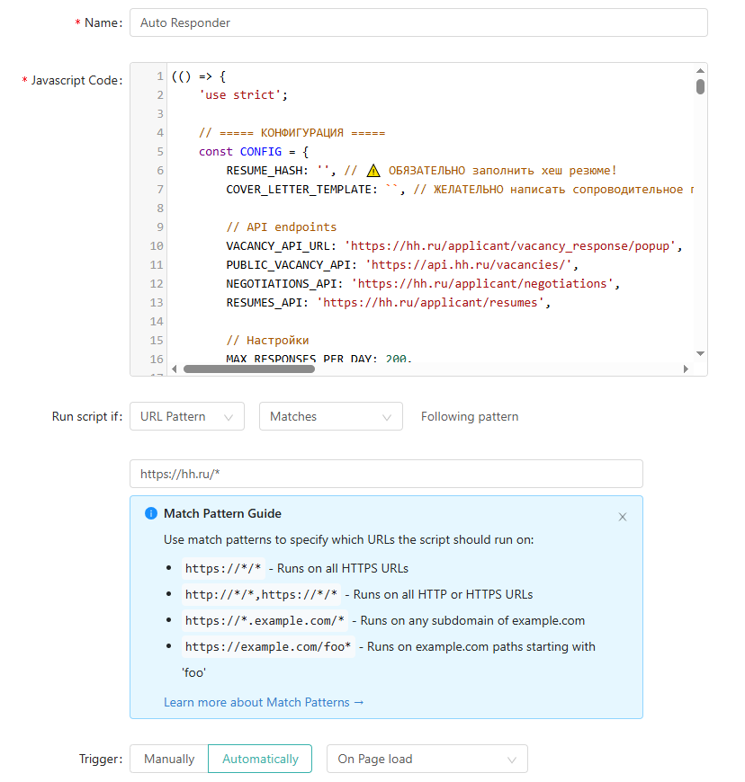

# HH.ru Auto Responder v2.0 🚀

Автоматический скрипт для автоматизации массовых откликов на вакансии на HH.ru с современной визуализацией, поддержкой любых URL и расширенными возможностями контроля.

---

## 🌟 Основные возможности (v2.0)

- **🎯 Любые URL c HH.ru** — поддержка поиска, главной, прямой ссылки на вакансию и других разделов.
- **🎨 Новый UI** — адаптивная и лаконичная панель управления (правый нижний угол), дружественный ко всем устройствам.
- **📊 Большая статистика** — отображение отправленных, пропущенных, обработанных, неудачных и ошибок.
- **🔍 Автоматическая диагностика** — встроенная комплексная проверка аккаунта, токенов и настроек.
- **🔔 Система уведомлений** — визуальные поп-апы для событий, ошибок и лимитов, аудио при необходимости.
- **⏸️ Пауза и остановка** — расширенные функции контроля (старт/стоп, пауза/снятие паузы прямо из интерфейса).
- **💾 Экспорт** — кнопка для экспорта логов и результатов работы в CSV или JSON.
- **🧹 Очистка логов** — возможность сброса истории одним кликом.

---

## 🚀 Быстрый старт

### 1. Подготовьте резюме и получите resume_hash

1. Перейдите на [hh.ru](https://hh.ru), авторизуйтесь.
2. Откройте страницу вашего резюме.
3. Откройте вкладку "Network" в консоли разработчика и найдите любой запрос, содержащий `/resume/`. Скопируйте параметр `resume_hash` из URL этого запроса. Либо просто перейдите на страницу своего резюме — всё, что идет после `resume/` в адресной строке, и есть ваш `resume_hash`.

### 2. Вставьте hash в скрипт

1. Откройте `hh-auto-responder.js` в редакторе.
2. В начале файла найдите строку конфигурации:
    ```javascript
    const CONFIG = {
        RESUME_HASH: 'ваш_хеш_резюме_здесь',
        COVER_LETTER_TEMPLATE: 'Ваш текст сопроводительного...',
        MAX_RESPONSES_PER_DAY: 200,
        DELAY_BETWEEN_RESPONSES: 3000,
        DELAY_BETWEEN_PAGES: 5000,
        MAX_RETRIES: 2,
        RETRY_DELAY: 2500
    };
    ```
3. Любые комментарии из примера выше вы можете оставить или изменить.

### 3. Запуск скрипта

**Вариант А (разовый запуск)**

1. Перейдите на любую страницу hh.ru, где хотите отправлять отклики.
2. Откройте консоль разработчика (F12).
3. Вставьте содержимое файла `hh-auto-responder.js` и нажмите Enter.
4. Панель управления появится справа внизу.

**Вариант Б (установка на постоянной основе через Scripty):**

1. Откройте [https://scripty.abhisheksatre.com/](https://scripty.abhisheksatre.com/) в браузере.
2. Вставьте содержимое файла `hh-auto-responder.js` в большое текстовое поле слева.
3. В правом поле "Site URL" укажите: `https://hh.ru/*`
4. Нажмите "Create Script" или "Update Script".
5. Добавьте сгенерированную закладку в закладки браузера.
6. Теперь для запуска скрипта достаточно кликнуть эту закладку на любой странице hh.ru — панель управления появится автоматически и скрипт будет работать постоянно, даже после перезагрузки страницы или сайта.

**Пример заполнения Scripty:**


---

## 📝 Использование

### Основные кнопки интерфейса

- **📤 Запустить** — начать массовую отправку откликов.
- **⏸️ Пауза** — приостановить процесс (можно вернуть нажатия).
- **⏹️ Стоп** — полностью остановить обработку.
- **📊 Статистика** — открыть подробную информацию по текущей сессии.
- **💾 Экспорт** — выгрузить логи или результаты.
- **🗑️ Очистить** — удалить историю работы и сбросить статистику.
- **⚙️ Настройки** — открыть модальное окно конфигурирования.

### Поддерживаемые сценарии URL

- `https://hh.ru/search/vacancy?...` — результаты поиска.
- `https://hh.ru/` — стартовая страница. Можно делать общий поиск.
- `https://hh.ru/vacancy/123456` — отклик на конкретную вакансию.
- Любые страницы hh.ru будут восприняты.

---

## ⚙️ Настройки и параметры

Все параметры редактируются в начале файла в объекте CONFIG. Пример:
```javascript
const CONFIG = {
    RESUME_HASH: 'ваш_хеш',          // Ваш resume_hash
    COVER_LETTER_TEMPLATE: 'Текст письма с {#vacancyName}', // Динамический текст. Используйте {#vacancyName} для подстановки.
    MAX_RESPONSES_PER_DAY: 200,      // Дневной лимит откликов
    DELAY_BETWEEN_RESPONSES: 3000,   // Задержка (мс) между откликами
    DELAY_BETWEEN_PAGES: 5000,       // Задержка между страницами (мс)
    MAX_RETRIES: 2,                  // Попыток повторной отправки
    RETRY_DELAY: 2500                // Задержка между попытками (мс)
};
```
- **!** Секретный ключ **RESUME_HASH** обязателен.
- В шаблоне письма можно использовать `{#vacancyName}`.

---

## 🛡️ Проверка и диагностика

1. Нажмите кнопку **🔍 Диагностика** (иконка шестерёнки).
2. Скрипт проверит:
    - Авторизацию и доступность API.
    - Корректность вашего резюме-хеша.
    - Наличие сессии и токенов.
    - Корректность переданного URL и фильтра.

3. При ошибках отобразится всплывающее уведомление с советами.

---

## 🗂️ Как работает логирование

- Логи откликов, результата, ошибок и статистики аккуратно пишутся в `localStorage`:
    - `hh_api_log` — полная история по каждому запросу;
    - `hh_sent_responses` — список id отправленных откликов;
    - `hh_stats` — агрегированная статистика;
    - `hh_filter_url` — сохраняется последний использованный URL поиска.

- Кнопка “Экспорт” выгружает логи в CSV или JSON — удобно для анализа или отчёта.

- Кнопка “Очистить” удаляет все записи.

---

## 💡 Полезные рекомендации

- Начинайте с малых лимитов (5-20 откликов), чтобы видеть работу и не попасть под санкции.
- Используйте фильтры поиска вакансий HH.ru — чем точнее фильтр, тем выше релевантность.
- Следите за статистикой, чтобы понимать динамику рынка.
- Экспортируйте логи — они могут пригодиться при поиске работы или для обратной связи.

---

## 🧩 Техническая структура скрипта

- **UIBuilder** — отвечает за отрисовку и обновление всех элементов управления и окон.
- **UI** — модальное окно, нотификации, тултипы, всплывающие подсказки.
- **Logger** — история действий, экспорт, очистка.
- **Responses** — учёт отправленных откликов, исключение дубликатов.
- **Utils** — общие вспомогательные функции (задержки, токены, трекинг времени).
- **ProgressTracker** — визуализация статуса, бегунок прогресса.
- **STATE** — всё состояние в одном месте: прогресс, паузы, ошибки и метрики.
- **Обработка ошибок** — скрипт при ошибках автоматически создаёт записи и может поставить процесс на автопаузу.

---

## 🛠️ Обновления и лог изменений

### v2.0 (последняя)

- Многозадачный UI с кнопками: экспорт, очистка, пауза, статистика, настройки.
- Новый механизм сбора и экспорта логов.
- Универсальное распознавание карточек вакансий.
- Диагностика (проверка авторизации, ключей, статуса).
- Улучшено логирование ошибок: пишутся ошибки API и сети с деталями.
- Динамический шаблон сопроводительного: подстановка названия вакансии.
- Контроль лимитов: пауза/стоп при ошибках, достижении капа и т.д.
- Поддержка полноценной мобильной и десктопной работы.

### v1.0

- Прототип. Простой интерфейс, ручная отправка, базовый лог.

---

## 🆘 Помощь и вопросы

Если что-то не работает:
1. Проверьте корректность RESUME_HASH.
2. Проверьте статус авторизации и токены.
3. Нажмите **Диагностику** — почти все ошибки определяются автоматически.
4. Ознакомьтесь с уведомлениями в UI или консолью браузера.

---

**Удачного автопоиска работы на HH.ru!**
Если скрипт помог — поделитесь обратной связью или поставьте ⭐

---
